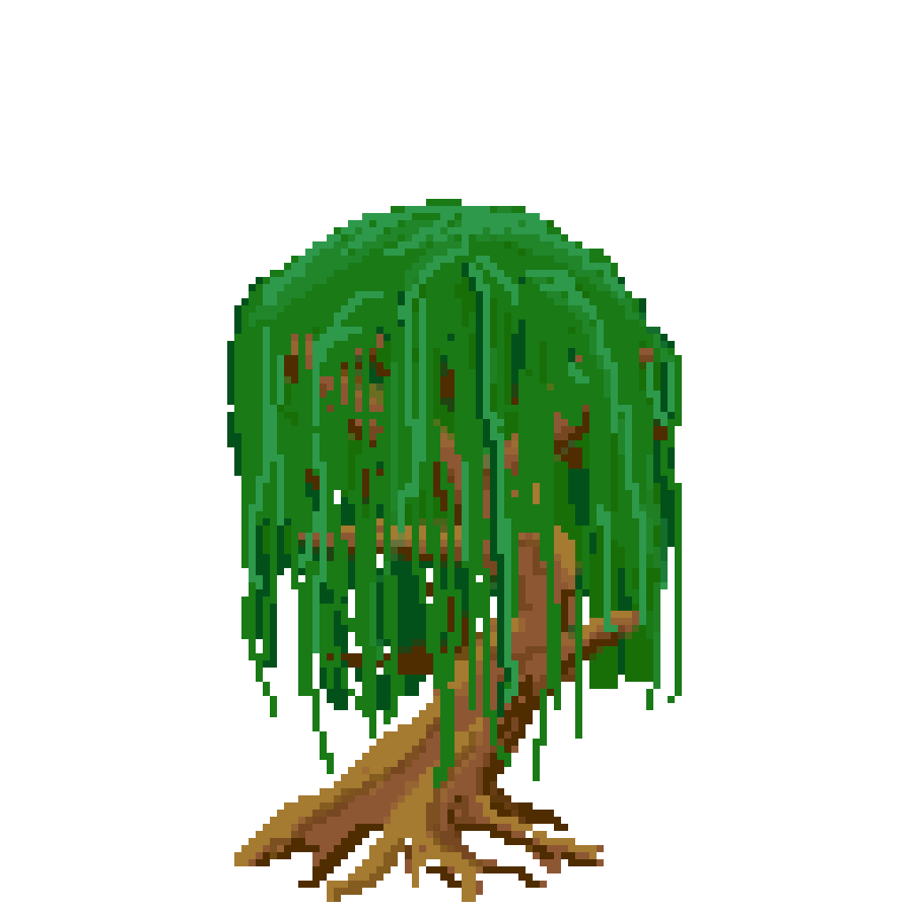

# Born to root

## Game made for the [Global Game Jam Geneva 2023](https://globalgamejam.org/2023/jam-sites/global-game-jam-geneva)

### Game:
Defend your tree in this sideview Tower Defense by digging deep into the ground with your roots and collect various ressources.  

### Controle:
|  | Action |
|--|--|
| Mouse | Choose tree |
| A | Turn in left |
| D | Turn in right |

### Stack:
**Design:** Aseprint 
**Game Engine:** Godot 3.5.1
**Sound Design:** Ableton Live

### Assets:

### Crédits:
**Sidney Gomes**  
GameArtist 2D / Pixel Art  
Portfolio: [ArtStation](https://www.artstation.com/sid_octopouce) [Itch.io](https://sid-fr.itch.io/)

**Nicholas Zivkovic**  
Game dev  
Portfolio: [GitHub](https://github.com/znichola) [Itch.io](https://znichola.itch.io/)

**Theotime du Merac**  
Sound Designer
Portfolio: [GitHub](https://github.com/trubat-d)

**Victor Héran**  
GameArtist 2d / Pixel Art  
Portfolio: [GitHub](https://github.com/LeRoiErrant) [ArtStation](https://www.artstation.com/le_roi_errant)

**Jérémy Dos Santos**  
Game Dev  
Portfolio: [GitHub](https://github.com/0xOnyx)

**Naïm DB**  
Source Control
Portfolio: [GitHub](https://github.com/naimdb)

**Jordan Chapelle**  
Game Dev  
Portfolio:  [GitHub](https://github.com/lebojo)  [Itch.io](https://lebojo.itch.io/)

**Shai Halimi**  
Game Dev  
Portfolio: [GitHub](https://github.com/werterhalimi) [Itch.io/](https://sha256.itch.io/)

**Hermès Rolle**  
Compositor and Sound-Designer
Portfolio: [GitHub](https://github.com/tricaducee)
